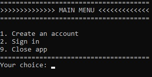
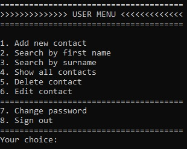
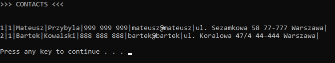

# AddressBook - Structured

Initial version of the AddressBook application written in a structured paradigm.\
[Here](https://github.com/mateusz-przybyla/AddressBook_ObjectOriented) you can find the AddressBook application written in a OOP paradigm.

## Table of contents

- [Overview](#overview)
  - [About](#about)
  - [Application design](#plan-freemind)
  - [Diagram UML](#diagram-uml)
  - [Screenshot](#screenshot)
- [My process](#my-process)
  - [Built with](#built-with)
  - [Useful resources](#useful-resources)

## Overview

### About

AddressBook application allows you to save your friends data such as: first name, surname, phone nuber, email and address.
Data are saved to the database (.txt file).
First create a user account and then you can add contacts to the address book.
You can show all your contacts everytime you want or search contacts by first name or surname.

Other functionalities:

- Editing contacts
- Deleting contacts
- Changing user password

### Application design

[Plan FreeMind](https://github.com/mateusz-przybyla/AddressBook_Structured/blob/master/AddressBook_Plan-FreeMind.pdf)

### Diagram UML

See in AddressBook_ObjectOriented application.

### Screenshots

- Main menu:

  

- User menu:

  

- Show all contacts:

  

## My process

### Built with

- Structured Programmimg
- Vectors
- Input/output with files (.txt)
- Libraries: vector, fstream
- Clean code

### Useful resources

- Project Przyszly Programista
- https://www.geeksforgeeks.org
- https://miroslawzelent.pl/kurs-c++/
- https://stackoverflow.com
